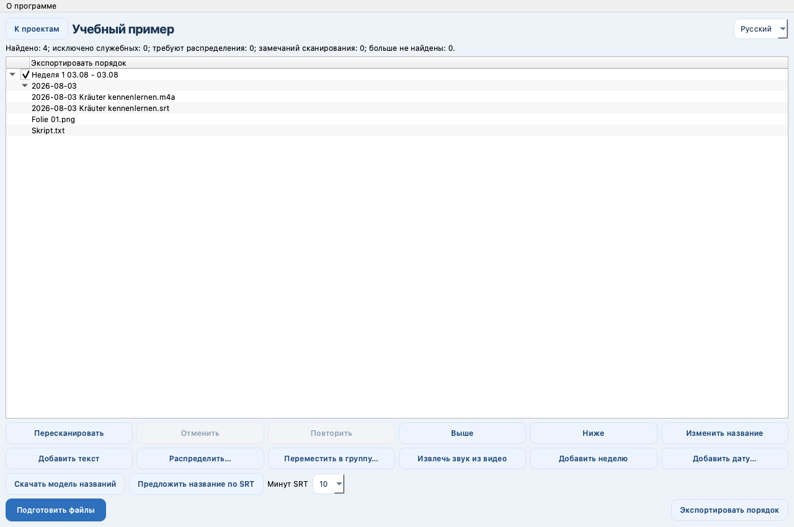

# Study Archive Prep

[User guide](https://popovantondev.github.io/StudyArchivePrep/Guide-en.html)

**[Русский](docs/ru/README.md) · [Deutsch](docs/de/README.md) · [English](README.md)**

macOS 13 or newer · Apple Silicon · Version 0.1.0

Study Archive Prep organizes study files into dated folders, helps review recordings and subtitles, and prepares an ordered publication plan for Telegram Media Sender.



## Project status

This is an early development build. It scans selected source folders, groups files by dates and weeks, lets you review and edit the publication order, copies files and creates ZIP archives with a local recovery journal, extracts audio from video without re-encoding, and exports a versioned publication plan. Local Russian title suggestions use the selected first five or ten minutes of an SRT after the model and local inference engine are installed. This app does not send Telegram messages.

## Run from source

Requires Python 3.12 and macOS.

```bash
python3.12 -m venv .venv
source .venv/bin/activate
python -m pip install -r requirements.txt
python -m pip install -e .
study-archive-prep
```

For an isolated UI preview, pass `--data-dir /tmp/study-archive-prep-preview`. The option redirects local app settings and project data.

## Safety and privacy

Source folders are selected by the user and scanned locally when a project is created or rescanned. Processing writes to a separate output folder, uses temporary files and a private recovery journal, and does not replace existing files. Extracted audio is kept in private app data before it is copied to the prepared output. Original recordings are retained. No files are uploaded by this application. Never add study files, subtitle text, personal paths, local projects, model weights, account credentials, or runtime logs to Git.

The project uses SQLite for project state and operation history. Model weights are downloaded only after the user asks for them and are not stored in this repository. See the [rights and third-party notices](THIRD_PARTY_NOTICES.md).

## Development

See the [development guide](docs/en/development.md), [architecture overview](docs/en/architecture.md), and [release checklist](docs/release-check.md). The full accepted requirements and progress handoff are maintained separately; runtime project memory is excluded from Git.

See [changelog](CHANGELOG.md) for version history and [third-party notices](THIRD_PARTY_NOTICES.md) for included component terms.

## License and permissions

The project owner's code remains under the rights stated in `RIGHTS.md`; no license for reuse is granted by public visibility alone. Third-party software and model licenses remain applicable.
